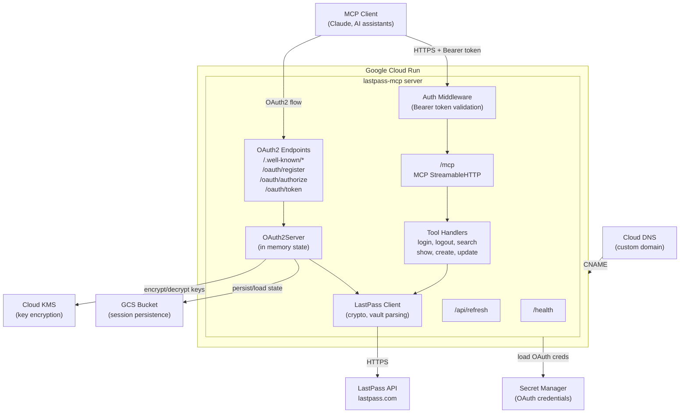
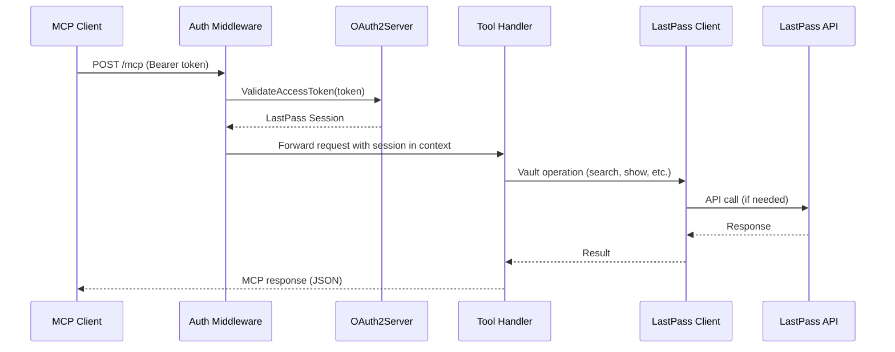
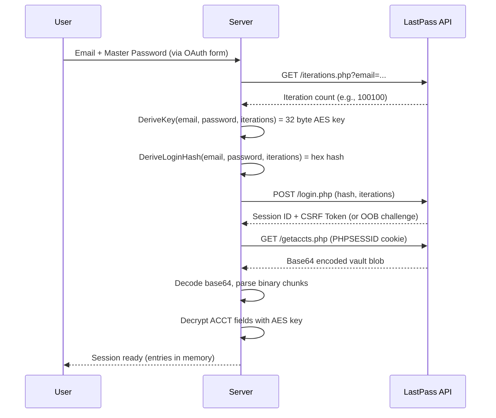
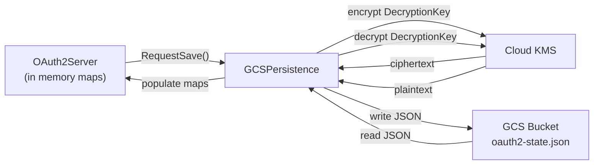

# Architecture

## System Architecture

The LastPass MCP Server is a monolithic Go application deployed as a single container on Google Cloud Run. It combines an OAuth 2.1 authorization server, an MCP protocol handler, and a LastPass API client into one binary.



## Component Relationships

### Request Flow



## Package Structure

```
cmd/lastpass-mcp/          Application entry point
internal/
  cli/                     Cobra CLI setup, flag parsing, server startup
  mcp/                     Core server logic
    server.go              MCP server, tool handlers, HTTP mux, auth middleware
    oauth2.go              OAuth 2.1 authorization server (all endpoints)
    persistence.go         GCS state persistence with KMS encryption
    templates/             Embedded HTML login page
  lastpass/                LastPass API integration
    client.go              HTTP client, login flow, vault download, CRUD
    crypto.go              PBKDF2, AES 256 CBC/ECB, PKCS7 padding
    vault.go               Binary vault blob parser, entry types
    retry.go               Exponential backoff with permanent error support
  telemetry/               OpenTelemetry tracing (JSONL file exporter)
```

## Key Design Decisions

### Direct LastPass API Integration
The server communicates directly with `https://lastpass.com` instead of wrapping the LastPass CLI. This gives full control over the authentication flow, supports out of band MFA verification, and avoids shell execution risks. The tradeoff is maintaining the binary vault parsing and encryption logic in Go.

### In Memory Session State
OAuth2 state (registered clients, authorization codes, token mappings) is stored in Go maps protected by `sync.RWMutex`. This keeps the architecture simple and avoids a database dependency. Sessions survive restarts via optional GCS persistence.

### Two Phase Terraform
Infrastructure is split into `init/` (bootstrap) and `iac/` (application). The init phase creates the GCS state bucket, service accounts, KMS keys, and enables APIs. The iac phase uses that state bucket as its backend and deploys Cloud Run, Artifact Registry, secrets, and DNS. This separation prevents circular dependencies (the state bucket must exist before Terraform can use it as a backend).

### KMS Encryption for DecryptionKey
When `KMS_KEY_NAME` is set, the vault decryption key is encrypted with Cloud KMS before being persisted to GCS. Even if the state bucket is compromised, the keys cannot be read without KMS access. The system gracefully handles migration from plaintext to encrypted storage.

### OAuth 2.1 with PKCE
All clients must use PKCE with S256 code challenge method. Dynamic Client Registration (RFC 7591) allows any MCP client to register, but redirect URIs are validated against a hardcoded allowlist for security.

## Data Flow

### Login and Vault Decryption



### State Persistence



Persistence uses a debounced save loop (5 second delay) to batch rapid changes. A final save is performed on shutdown with a 10 second timeout.

## External Service Integrations

| Service                | Purpose                                    | Authentication        |
|------------------------|--------------------------------------------|-----------------------|
| LastPass API           | Vault login, download, CRUD operations     | PBKDF2 login hash + PHPSESSID cookie |
| GCP Secret Manager     | Store OAuth client credentials             | Service account IAM   |
| GCS                    | Persist OAuth2 state across restarts       | Service account IAM   |
| Cloud KMS              | Encrypt vault decryption keys at rest      | Service account IAM   |
| Artifact Registry      | Docker image storage                       | gcloud Docker auth    |
