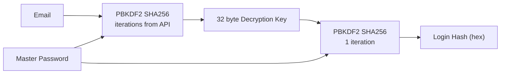

# Authentication and Authorization

## Overview

The LastPass MCP Server uses a layered authentication model:

1. **OAuth 2.1** secures MCP client access to the server (Bearer tokens)
2. **LastPass Authentication** verifies the user's identity with the LastPass API (PBKDF2 + login hash)
3. **GCP IAM** protects infrastructure resources (service accounts)

## OAuth 2.1 Flow

The server implements a full OAuth 2.1 Authorization Server compliant with RFC 8414 (Authorization Server Metadata), RFC 7591 (Dynamic Client Registration), and RFC 9728 (Protected Resource Metadata).

### Sequence Diagram

```mermaid
sequenceDiagram
    participant C as MCP Client
    participant S as MCP Server
    participant U as User (browser)
    participant LP as LastPass API

    Note over C,S: 1. Discovery
    C->>S: GET /.well-known/oauth-protected-resource
    S-->>C: Authorization server URL, scopes
    C->>S: GET /.well-known/oauth-authorization-server
    S-->>C: Endpoints, supported methods

    Note over C,S: 2. Client Registration
    C->>S: POST /oauth/register {redirect_uris}
    S-->>C: {client_id, client_secret}

    Note over C,U: 3. Authorization (PKCE)
    C->>C: Generate code_verifier, compute code_challenge
    C->>U: Redirect to /oauth/authorize?client_id=...&code_challenge=...
    U->>S: GET /oauth/authorize (renders login page)
    U->>S: POST /oauth/authorize {email, password}
    S->>LP: Authenticate with LastPass API
    LP-->>S: Session (vault decrypted)
    S->>U: Redirect to redirect_uri?code=...&state=...
    U->>C: Authorization code

    Note over C,S: 4. Token Exchange
    C->>S: POST /oauth/token {code, code_verifier}
    S->>S: Validate PKCE (S256)
    S-->>C: {access_token, refresh_token, expires_in: 86400}

    Note over C,S: 5. Authenticated Requests
    C->>S: POST /mcp (Authorization: Bearer <token>)
    S->>S: Validate token, inject LastPass session
    S-->>C: MCP response

    Note over C,S: 6. Token Refresh
    C->>S: POST /oauth/token {grant_type: refresh_token, refresh_token}
    S-->>C: {new access_token, new refresh_token}
```



### OAuth2 Endpoints

| Endpoint                                    | Method | Description                        | Auth Required |
|---------------------------------------------|--------|------------------------------------|---------------|
| `/.well-known/oauth-protected-resource`     | GET    | Resource metadata (RFC 9728)       | No            |
| `/.well-known/oauth-authorization-server`   | GET    | Auth server metadata (RFC 8414)    | No            |
| `/oauth/register`                           | POST   | Dynamic client registration        | No            |
| `/oauth/authorize`                          | GET    | Render LastPass login page         | No            |
| `/oauth/authorize`                          | POST   | Process login form submission      | No            |
| `/oauth/token`                              | POST   | Token exchange and refresh         | No            |

### Scopes

| Scope         | Description                              |
|---------------|------------------------------------------|
| `vault:read`  | Search and view vault entries            |
| `vault:write` | Create and update vault entries          |

Both scopes are granted on every token issuance. Scope enforcement is implicit through the available MCP tools.

### PKCE Requirement

PKCE is mandatory. Only the `S256` code challenge method is supported. The server validates the `code_verifier` against the stored `code_challenge` during token exchange:

```
challenge = BASE64URL(SHA256(verifier))
```

### Redirect URI Allowlist

Redirect URIs are validated against a hardcoded allowlist. This prevents misconfiguration from weakening security.

**Allowed localhost URIs** (any path):
- `http://localhost:8000`
- `http://localhost:3000`
- `http://127.0.0.1:8000`
- `http://127.0.0.1:3000`

**Allowed production URIs** (exact match):
- `https://lastpass.mcp.scm-platform.org/oauth/callback`

### Token Lifecycle

- **Access tokens** expire after 24 hours (86400 seconds)
- **Refresh tokens** are single use: exchanging a refresh token issues both a new access token and a new refresh token
- **Authorization codes** expire after 10 minutes and are single use
- **Authorization states** expire after 10 minutes
- A background goroutine cleans expired states and codes every minute
- Tokens persist until explicit logout or server restart (unless GCS persistence is enabled)

### Client Registration

Clients register via `POST /oauth/register` with their redirect URIs. The server generates a `client_id` and `client_secret` (cryptographically random tokens). Client secrets do not expire.

Supported token endpoint authentication methods:
- `client_secret_basic` (HTTP Basic auth)
- `client_secret_post` (form parameter)

## LastPass Authentication

When a user submits credentials on the OAuth authorize page, the server authenticates directly with the LastPass API.

### Key Derivation



1. Fetch iteration count from `GET /iterations.php?email=...` (typically 100100 or 600100)
2. Derive 32 byte AES key: `PBKDF2_SHA256(password, email, iterations, 32)`
3. Derive login hash: `hex(PBKDF2_SHA256(key, password, 1, 32))`
4. Authenticate with `POST /login.php` using the login hash (never the raw key)

### Out of Band (MFA) Verification

If LastPass requires out of band verification (push notification or email), the server polls `login.php` with `outofbandrequest=1` and `outofbandretry=1` parameters every 3 seconds for up to 2 minutes, waiting for user approval.

### Trusted Device ID

The server generates a random 32 character device ID on startup and includes it as the `uuid` parameter in login requests. This reduces the frequency of email verification challenges from LastPass.

## Session Management

Each authenticated Bearer token maps to a `lastpass.Session` containing:
- Email address
- 32 byte AES decryption key (for vault operations)
- LastPass session ID (PHPSESSID cookie value)
- CSRF token (required for write operations)
- Decrypted vault entries (in memory)

### Security Properties

- The `DecryptionKey` field in `Session` has no JSON tag, preventing accidental serialization in Go's standard `encoding/json`
- When persisted to GCS, decryption keys are optionally encrypted with Cloud KMS before storage
- Sessions are stored in Go maps with `sync.RWMutex` protection for concurrent access
- Token invalidation on logout removes the mapping immediately

## GCP IAM (Infrastructure)

The server runs under a custom Cloud Run service account (`<prefix>-cloudrun-<env>`) with the following roles:

| Role                                      | Resource               | Purpose                           |
|-------------------------------------------|------------------------|-----------------------------------|
| `roles/secretmanager.secretAccessor`      | Project                | Read OAuth credentials            |
| `roles/storage.objectUser`               | State bucket           | Read/write session persistence    |
| `roles/cloudkms.cryptoKeyEncrypterDecrypter` | KMS crypto key      | Encrypt/decrypt vault keys        |
| `roles/viewer`                            | Project                | General read access               |

Default service accounts are never used. Custom accounts are created in the `init/` Terraform phase.
