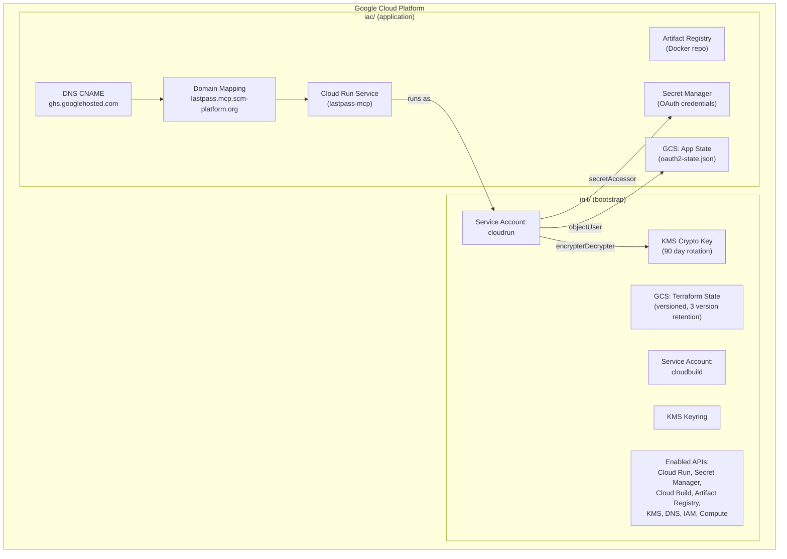

# Deployment

## Overview

The LastPass MCP Server deploys to Google Cloud Run as a Docker container. Infrastructure is managed by Terraform, split into two phases:

1. **init/** : Bootstrap resources (state bucket, service accounts, KMS keys, API enablement)
2. **iac/** : Application infrastructure (Artifact Registry, Cloud Run, secrets, DNS, state bucket)

Both phases read configuration from a shared `config.yaml` at the project root.

## Infrastructure Diagram



## Prerequisites

- **Go 1.26+** (for building)
- **Docker** (for container builds)
- **Terraform** (for infrastructure)
- **gcloud CLI** (authenticated with project access)
- **GCP Project** with billing enabled

## First Time Deployment

### Step 1: Bootstrap Infrastructure

```bash
# Review what will be created
make init-plan

# Deploy bootstrap resources
make init-deploy
```

This creates:
- GCS bucket for Terraform state (versioned, lifecycle rules)
- Cloud Build and Cloud Run service accounts
- KMS keyring and crypto key for state encryption
- Enables required GCP APIs
- Auto updates `iac/provider.tf` with the GCS backend configuration
- Auto configures Docker authentication for Artifact Registry

### Step 2: Deploy Application

```bash
# Review application infrastructure
make plan

# Build Docker image, push to Artifact Registry, deploy Cloud Run
make deploy
```

This creates:
- Artifact Registry Docker repository
- Docker image (built locally, pushed to registry)
- Cloud Run v2 service with environment variables
- Secret Manager secret shell for OAuth credentials
- GCS bucket for session state persistence
- Custom domain mapping with managed SSL
- DNS CNAME record
- IAM bindings (Secret Manager access, state bucket access)

### Step 3: Add OAuth Credentials

After deployment, manually add the OAuth credentials secret version:

```bash
gcloud secrets versions add scm-pwd-lastpass-oauth-creds \
  --data-file=$HOME/.credentials/scm-pwd-lastpass.json \
  --project=<project-id>
```

## Subsequent Deployments

```bash
make deploy
```

Terraform detects source file changes via file hashes and rebuilds the Docker image only when needed. The Cloud Run service is updated with the new image.

## Environment Configuration

### Cloud Run Environment Variables

| Variable       | Value                                     | Source          |
|----------------|-------------------------------------------|-----------------|
| `HOST`         | `0.0.0.0`                                | Hardcoded       |
| `SECRET_NAME`  | OAuth secret name                         | secrets.tf      |
| `BASE_URL`     | `https://lastpass.mcp.scm-platform.org`   | config.yaml     |
| `ENVIRONMENT`  | `prd`                                     | config.yaml     |
| `PROJECT_ID`   | GCP project ID                            | config.yaml     |
| `STATE_BUCKET` | `<prefix>-state-<env>`                    | workload-mcp.tf |
| `KMS_KEY_NAME` | Full KMS key resource name                | workload-mcp.tf |

### Resource Limits

| Resource       | Value   |
|----------------|---------|
| CPU            | 1 vCPU  |
| Memory         | 256 MiB |
| Min instances  | 0       |
| Max instances  | 3       |
| CPU idle       | Enabled |

CPU idle mode allows the instance to be throttled when not processing requests, reducing costs.

## Scaling Strategy

Cloud Run auto scales based on incoming traffic:
- **Min 0 instances**: Scales to zero when idle (no cost when unused)
- **Max 3 instances**: Caps concurrent instances for cost control
- **Scale up**: Cloud Run creates new instances when request concurrency exceeds the default threshold
- **Scale down**: Instances are terminated after an idle period

## Custom Domain and SSL

The domain `lastpass.mcp.scm-platform.org` is configured with:
1. `google_cloud_run_domain_mapping`: Maps the domain to the Cloud Run service
2. `google_dns_record_set`: CNAME record pointing to `ghs.googlehosted.com.` (TTL 300s)
3. Google manages SSL certificate provisioning and renewal automatically

## Rollback Procedures

### Application Rollback

Cloud Run maintains traffic revisions. To roll back to a previous revision:

```bash
# List revisions
gcloud run revisions list --service lastpass-mcp --region europe-west1

# Route traffic to a specific revision
gcloud run services update-traffic lastpass-mcp \
  --to-revisions=<revision-name>=100 \
  --region europe-west1
```

### Infrastructure Rollback

Terraform state is versioned in the GCS bucket (3 version retention). To revert:

```bash
cd iac
terraform plan          # Review current state
terraform apply         # Apply desired configuration
```

## Teardown

### Remove Application (keep bootstrap)

```bash
make undeploy
```

This destroys Cloud Run, Artifact Registry, secrets, DNS, domain mapping, and the state bucket.

### Full Teardown (including bootstrap)

```bash
make undeploy           # Remove application
make init-destroy       # Remove bootstrap (interactive confirmation required)
```

> **Warning:** `init-destroy` removes the Terraform state bucket. This operation is irreversible.

## Configuration Reference (config.yaml)

| Field                                 | Value                                  |
|---------------------------------------|----------------------------------------|
| `prefix`                              | `scmlastpass`                          |
| `project_name`                        | `lastpass-mcp`                         |
| `env`                                 | `prd`                                  |
| `gcp.project_id`                      | `project-fb127223-bfef-43d1-94e`       |
| `gcp.location`                        | `europe-west1`                         |
| `gcp.resources.cloud_run.name`        | `lastpass-mcp`                         |
| `gcp.resources.cloud_run.cpu`         | `1`                                    |
| `gcp.resources.cloud_run.memory`      | `256Mi`                                |
| `gcp.resources.cloud_run.min_instances` | `0`                                  |
| `gcp.resources.cloud_run.max_instances` | `3`                                  |
| `parameters.base_url`                 | `https://lastpass.mcp.scm-platform.org`|
| `parameters.domain`                   | `lastpass.mcp.scm-platform.org`        |
| `parameters.dns_zone`                 | `scm-platform-org`                     |
| `secrets.oauth_credentials`           | `scm-pwd-lastpass-oauth-creds`         |
