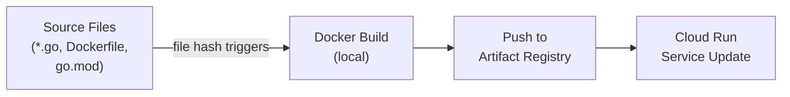

# DevOps Toolchain

## Build System

The project uses a comprehensive `Makefile` that auto detects project structure and supports multiple platforms.

### Build Commands

| Command          | Description                                    |
|------------------|------------------------------------------------|
| `make build`     | Build for current platform into `bin/`         |
| `make build-all` | Build for linux/amd64, darwin/amd64, darwin/arm64 |
| `make rebuild`   | Clean and rebuild for current platform         |
| `make install`   | Install binary to `~/.local/bin`               |

The build produces platform specific binaries named `lastpass-mcp-<os>-<arch>` and creates a symlink at the project root. On macOS, binaries are codesigned with an ad hoc signature.

### Cross Platform Support

| Platform       | Binary Name                    |
|----------------|--------------------------------|
| Linux AMD64    | `bin/lastpass-mcp-linux-amd64`   |
| macOS Intel    | `bin/lastpass-mcp-darwin-amd64`  |
| macOS Apple    | `bin/lastpass-mcp-darwin-arm64`  |

A launcher script (`bin/lastpass-mcp.sh`) auto detects the platform and executes the correct binary.

## Testing Strategy

### Unit Tests

```bash
make test       # Run all tests with verbose output
```

The project includes tests for:
- **Cryptography** (`internal/lastpass/crypto_test.go`): PBKDF2 key derivation, AES CBC/ECB encryption and decryption, PKCS7 padding
- **Vault parsing** (`internal/lastpass/vault_test.go`): Binary blob parsing, field extraction, payment card notes parsing
- **Retry logic** (`internal/lastpass/retry_test.go`): Exponential backoff, permanent errors, context cancellation
- **OAuth2** (`internal/mcp/oauth2_test.go`): Redirect URI validation, PKCE verification, token lifecycle
- **MCP server** (`internal/mcp/server_test.go`): Tool handler behavior

### Code Quality

```bash
make check      # Run all quality checks in sequence
```

This runs:
1. `make fmt` : Go format (`go fmt ./...`)
2. `make vet` : Static analysis (`go vet ./...`)
3. `make lint` : golangci-lint (falls back to `go vet` if not installed)
4. `make test` : All unit tests

## CI/CD Pipeline

### Docker Build

Docker builds are managed by Terraform via the `kreuzwerker/docker` provider. The `docker.tf` configuration:

1. Builds the Docker image locally using the project's multi stage Dockerfile
2. Pushes to Artifact Registry (`<region>-docker.pkg.dev/<project>/<repo>/lastpass-mcp:latest`)
3. Triggers rebuilds when source files change (using file hash comparison)



### Monitored Source Files

The Docker build triggers on changes to:
- `Dockerfile`
- `go.mod`, `go.sum`
- `cmd/lastpass-mcp/main.go`
- `internal/cli/cli.go`
- `internal/lastpass/client.go`, `crypto.go`, `vault.go`
- `internal/mcp/server.go`, `oauth2.go`

### Deployment Commands

```bash
make plan       # Preview infrastructure changes (including Docker build)
make deploy     # Build, push, and deploy in one step
make undeploy   # Destroy application infrastructure
```

## Container Image

The Dockerfile uses a multi stage build:

**Builder stage** (golang:1.26):
- Copies go.mod/go.sum first for layer caching
- Downloads dependencies
- Builds a statically linked binary (`CGO_ENABLED=0`)
- Strips debug symbols (`-ldflags="-s -w"`)

**Runtime stage** (alpine:latest):
- Installs CA certificates and timezone data
- Creates a non root `appuser`
- Copies only the compiled binary
- Exposes port 8080
- Includes a health check (`wget` to `/health` every 30 seconds)
- Entry point: `/app/lastpass-mcp mcp`

## Observability

### Tracing

The server includes an OpenTelemetry setup (`internal/telemetry/`) that exports traces as JSONL to a local file. The `StartSpan` and `EndSpan` helpers provide structured tracing with automatic error recording.

### Logging

The server uses Go's structured `log/slog` package throughout. Key log events:
- Server startup (address, base URL)
- OAuth2 client registration
- LastPass authentication success/failure
- Vault download and decryption
- Token issuance and refresh
- State persistence save/load
- Shutdown signals

### Health Check

The `/health` endpoint returns HTTP 200 with body `OK`. It is used by:
- The Docker HEALTHCHECK instruction (every 30 seconds)
- Cloud Run's built in health monitoring
