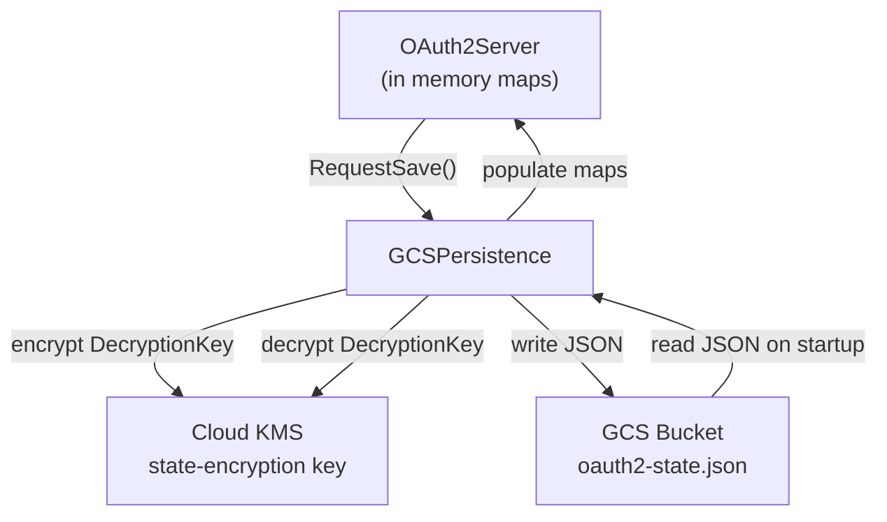

# Session Persistence

## Overview

The server persists OAuth2 state (registered clients and token to session mappings) to a GCS bucket so that sessions survive container restarts on Cloud Run. When configured, vault decryption keys are encrypted with Cloud KMS before being written to storage.

## Architecture



## Configuration

Persistence is enabled when the `STATE_BUCKET` environment variable is set. KMS encryption is enabled when `KMS_KEY_NAME` is additionally set.

| Variable       | Description                              | Required |
|----------------|------------------------------------------|----------|
| `STATE_BUCKET` | GCS bucket name for state storage        | For persistence |
| `KMS_KEY_NAME` | Full Cloud KMS crypto key resource name  | For encryption  |

## Persisted State Structure

The state is stored as a single JSON file (`oauth2-state.json`) in the GCS bucket:

```json
{
  "tokens": {
    "<bearer_token>": {
      "bearer_token": "...",
      "session": {
        "email": "user@example.com",
        "decryption_key": "<base64, optionally KMS encrypted>",
        "session_id": "...",
        "csrf_token": "...",
        "entries": [...],
        "created_at": "..."
      },
      "client_id": "...",
      "created_at": "..."
    }
  },
  "clients": {
    "<client_id>": {
      "client_id": "...",
      "client_secret": "...",
      "redirect_uris": [...]
    }
  },
  "saved_at": "..."
}
```

## Save Behavior

Saves are debounced to avoid excessive writes:

1. When state changes (token issued, client registered, session updated), `RequestSave()` is called
2. The save channel is buffered (size 1), so rapid changes are collapsed into a single save
3. After receiving a save signal, the persistence layer waits 5 seconds for additional changes
4. The state is then serialized and written to GCS
5. On server shutdown, a final save is performed with a 10 second timeout

## KMS Encryption

When `KMS_KEY_NAME` is configured:

- **On save**: Each session's `DecryptionKey` (the 32 byte AES key derived from the user's master password) is encrypted with Cloud KMS before being included in the JSON
- **On load**: The encrypted key is decrypted with Cloud KMS before being stored in memory
- **Migration**: If decryption fails (data was stored in plaintext before KMS was enabled), the raw bytes are used as is. This allows seamless migration from plaintext to encrypted storage

## Security Considerations

- The GCS bucket uses uniform bucket level access control
- Only the Cloud Run service account has `roles/storage.objectUser` on the bucket
- Only the Cloud Run service account has `roles/cloudkms.cryptoKeyEncrypterDecrypter` on the KMS key
- Without KMS, the decryption key is stored in plaintext in GCS (protected by IAM only)
- With KMS, a bucket compromise alone cannot reveal vault decryption keys
- The KMS key rotates automatically every 90 days
